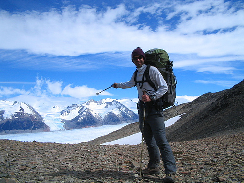
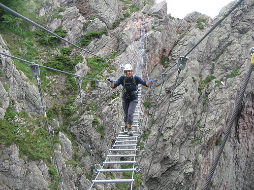

**RU** | [EN](README.md)

# Поиск изображений соответствующих описанию

- [Посмотреть Jupyter-блокнот](joint_image_text_based_retrieval_ru.ipynb)

Стэк: `keras_nlp`, `keras`, `ResNet50`, `tensorflow`, `nltk`, `sklearn`, `pandas`, `matplotlib`, `pillow`, BERT, NLP, CV, эмбеддинги

## Описание

Вы работаете в фотохостинге для профессиональных фотографов "Со Смыслом" ("With Sense").

Ваши пользователи размещают свои фотографии на хостинге и сопровождают их полным описанием: указывают место съёмок, модель камеры и т. д. Отличительная особенность сервиса — описание: его может предоставить не только тот, кто размещает фотографию, но и другие пользователи портала. Например, для этой фотографии

  
описание выглядит так:

*A hiker poses for a picture in front of stunning mountains and clouds.*

Ваш отдел занимается экспериментом по разработке поиска референсных фотографий для фотографов. Суть поиска заключается в следующем: пользователь сервиса вводит описание нужной сцены. Например, такое:

*A man is crossing a mountain pass on a metal bridge.*

Сервис выводит несколько фотографий с такой же или похожей сценой.

Чтобы эксперимент получил право на жизнь, нужно защитить его перед руководителем компании. Для защиты необходимо презентовать так называемый PoC (Proof of Concept, Проверка концепции) — продемонстрировать, что такой проект практически осуществим. Вам поручено разработать демонстрационную версию поиска изображений по запросу.

Для демонстрационной версии нужно выбрать лучшую модель, которая получит векторное представление изображения, векторное представление текста, а на выходе выдаст число от 0 до 1 — и покажет, насколько текст и картинка подходят друг другу.

На основе лучшей модели можно будет собрать предварительную версию продукта, которую вы покажете руководителю компании.

- Разработать демонстрационную версию поиска изображений по запросу
- Обучить модель, которая получит векторное представление изображения и текста, а на выходе выдаст число от 0 до 1 — покажет, насколько текст и картинка подходят друг другу

## Выводы

Решалась задача "Совместный поиск на основе изображений и текста (Joint image-text based retrieval)". Нужно было построить модель машинного обучения которая оценивает соответствие содержания изображения и её текстового описания.

Исходными данными послужили
- в обучающей выборке 5822 сочетания изображение-описание и 977 файлов изображений
  - 5822 оценок сходства от экспертов
  - 51323 оценок сходства от краудсорсинга
- в тестовой выборке 500 сочетаний изображение-описание и 100 файлов изображений

Они были обработаны и проанализированы. Оценки были преобразованы в одну собственным алгоритмом. Из обучающей выборки удалены данные запрещённые по условиям задачи обработке компанией, по наличию слов в описании.

По условию задачи выбран только один фреймворк — Keras

Были подготовлены и объеденины вместе эмбеддинги для входа модели, которые в свою очередь получены моделями:
- Для текста `bert_tiny_en_uncased`
- Для изображений `ResNet50` с `backbone` предобученным готовыми весами `imagenet` без последнего слоя

Обучено 3 модели машинного обучения с метрикой RMSE
- Константная модель: 0.2150
- Линейная регрессия: 15761
- Собственная полносвязная: 0.0541

Тестирование модели и визуальная проверка показали  
(на 10 примерах, результаты модели отсортированы по схожести и взяты 5 с самой высокой оценкой схожести)
- находит довольно схожие запросу изображения но далеко не все
- попадаются изображения максимально похожие среди всех
- так же и совсем не похожие